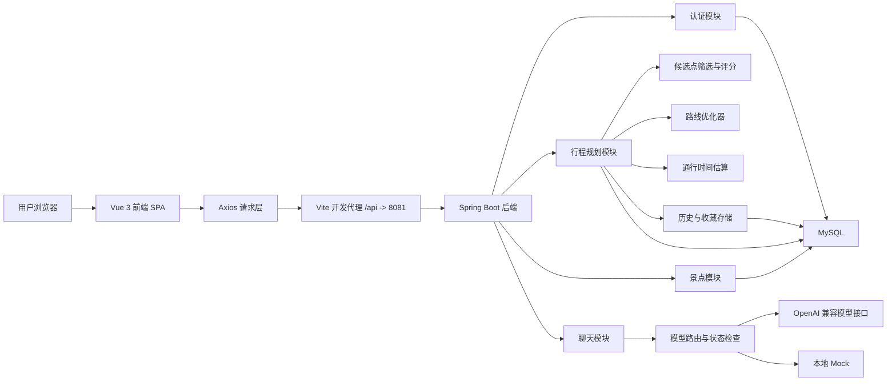

# 行城有数

> 面向城市短途文旅场景的个性化智能行程规划系统

“行城有数”是一个围绕成都城市游、一日游和短途游场景构建的前后端分离项目。  
系统核心不是单纯依赖大模型生成一段旅游文案，而是采用“规则与优化算法主导 + LLM 辅助问答与解释增强”的混合方案，重点解决以下问题：

- 如何在有限时间内生成可执行的游玩路线
- 如何同时考虑预算、主题偏好、天气、夜游和步行强度
- 如何让用户知道“为什么推荐这条路线，而不是另一条”
- 如何在路线生成后继续重排、替换、收藏和回看

## 项目亮点

- 多方案路线生成：一次返回 3 条候选路线，支持结果页直接对比
- 解释型推荐：不仅告诉用户推荐什么，还说明为什么推荐、为什么不优先推荐其他方案
- 地图路线展示：基于 Leaflet 将路线节点按顺序绘制到地图上
- 动态重排与站点替换：支持“换一版路线”和单点替换后整条路线重算
- 历史行程与收藏：支持收藏当前选中方案，并可自定义路线名称
- RESTful 接口设计：认证、行程、景点和聊天接口按资源风格组织
- 聊天状态检查：提供模型状态接口，便于判断当前真实模型是否可用
- 工程化收口：敏感配置已改为环境变量读取，跨域策略可配置

## 为什么这个项目有价值

很多“AI 旅游推荐”项目只停留在聊天问答层面，用户得到的往往是松散的景点建议，而不是一条真正可执行的路线。

本项目的差异点在于：

1. 路线生成由后端优化逻辑主导，而不是把结果完全交给大模型。
2. 输出结果是结构化时间轴、地图路径和多方案对比，而不是单段文本。
3. 推荐结果具备解释能力，适合课程项目、大创答辩和论文展示。

## 系统能力概览

### 用户侧能力

- 注册、登录、退出、获取当前用户
- 填写出行需求并生成路线
- 查看多方案对比结果
- 在地图上查看路线
- 动态重排路线
- 替换某一个景点
- 查看景点详情与营业状态
- AI 聊天问答
- 查看历史行程
- 收藏路线并自定义命名

### 系统侧能力

- POI 候选点筛选与综合评分
- 带时间窗约束的路线搜索
- 营业状态动态校验
- 本地通行时间估算
- 行程快照持久化
- 模型路由、降级与状态检测

## 技术架构

### 技术栈

**前端**

- Vue 3
- Vue Router 4
- Element Plus
- Axios
- Leaflet
- Vite

**后端**

- Spring Boot 3.1.5
- MyBatis-Plus 3.5.4.1
- MySQL 8.x
- Lombok

### 架构说明



### 核心设计思路

- 路线规划由后端算法完成
- 聊天和解释增强由大模型辅助完成
- 前端负责交互、可视化和状态恢复
- 数据库负责用户、POI 和行程快照持久化

## 主要页面

- `/`：首页，填写出行需求并发起规划
- `/auth`：登录与注册
- `/result`：路线对比、时间轴、地图和解释信息
- `/history`：历史行程与收藏路线
- `/detail/:id`：景点详情与站点替换

## RESTful API 概览

### 认证接口

- `POST /api/users`：注册
- `POST /api/sessions`：登录
- `DELETE /api/sessions/current`：退出当前会话
- `GET /api/users/me`：获取当前用户

### 行程接口

- `POST /api/itineraries`：生成行程
- `GET /api/itineraries`：获取历史列表
- `GET /api/itineraries/{id}`：获取行程详情
- `PATCH /api/itineraries/{id}/replan`：换一版路线
- `PATCH /api/itineraries/{id}/nodes/{poiId}/replacement`：替换某个站点
- `PUT /api/itineraries/{id}/favorite`：收藏当前选中方案并命名
- `DELETE /api/itineraries/{id}/favorite`：取消收藏

### 景点接口

- `GET /api/pois`：获取景点列表
- `GET /api/pois/{id}`：获取景点详情

### 聊天接口

- `POST /api/chat/messages`：发送聊天消息
- `GET /api/chat/messages/status`：获取聊天服务状态

## 快速开始

### 1. 环境要求

- Node.js 18+
- npm 9+
- JDK 17
- Maven 3.9+
- MySQL 8.x

### 2. 初始化数据库

首次初始化执行：

```sql
source F:/dachuang/backend/sql/init.sql;
```

如果数据库是旧版本，请按实际历史执行升级脚本：

- `backend/sql/upgrade_dynamic_itinerary.sql`
- `backend/sql/upgrade_itinerary_history_favorite.sql`
- `backend/sql/upgrade_itinerary_custom_title.sql`

### 3. 配置环境变量

项目已将敏感配置改为环境变量读取。

后端关键配置项如下：

```yaml
server:
  port: 8081

spring:
  datasource:
    url: ${DB_URL:jdbc:mysql://127.0.0.1:3306/city_trip_db?useUnicode=true&characterEncoding=UTF-8&serverTimezone=Asia/Shanghai}
    username: ${DB_USERNAME:root}
    password: ${DB_PASSWORD:}

app:
  cors:
    allowed-origin-patterns: ${APP_CORS_ALLOWED_ORIGIN_PATTERNS:http://localhost:3000,http://127.0.0.1:3000}
  redis:
    enabled: ${APP_REDIS_ENABLED:false}

llm:
  provider: ${LLM_PROVIDER:real}
  fallback-to-mock: ${LLM_FALLBACK_TO_MOCK:false}
  timeout-seconds: ${LLM_TIMEOUT_SECONDS:20}
  openai:
    enabled: ${LLM_OPENAI_ENABLED:true}
    api-key: ${OPENAI_API_KEY:}
    base-url: ${OPENAI_BASE_URL:https://api.openai.com/v1}
    model: ${OPENAI_MODEL:gpt-5.3}
    temperature: ${OPENAI_TEMPERATURE:0.7}
```

PowerShell 示例：

```powershell
$env:DB_PASSWORD="你的数据库密码"
$env:OPENAI_API_KEY="你的模型密钥"
$env:OPENAI_BASE_URL="你的模型网关地址"
$env:OPENAI_MODEL="你的模型名"
```

### 4. 启动后端

```bash
cd backend
mvn spring-boot:run
```

或者：

```bash
cd backend
mvn -q -DskipTests package
java -jar target/citytrip-backend-0.0.1-SNAPSHOT.jar
```

### 5. 启动前端

```bash
cd frontend
npm install
npm run dev
```

默认开发环境：

- 前端：`http://127.0.0.1:3000`
- 后端：`http://127.0.0.1:8081`
- 前端通过 Vite 代理转发 `/api`

## 项目结构

```text
.
├─backend
│  ├─sql
│  │  ├─init.sql
│  │  ├─upgrade_dynamic_itinerary.sql
│  │  ├─upgrade_itinerary_custom_title.sql
│  │  └─upgrade_itinerary_history_favorite.sql
│  └─src/main/java/com/citytrip
│     ├─annotation
│     ├─common
│     ├─config
│     ├─controller
│     ├─mapper
│     ├─model
│     ├─service
│     ├─util
│     └─CityTripApplication.java
├─frontend
│  └─src
│     ├─api
│     ├─components
│     ├─router
│     ├─store
│     └─views
├─README.md
```

## 项目文档


如果你需要课程设计、大创申报书或答辩材料，可以优先参考上面的正式文档版本。

## 当前完成度

当前项目已经完成以下较完整能力：

- 行程规划主链路
- 多方案对比与解释型推荐
- 地图展示
- 动态重排与站点替换
- 历史行程、收藏与命名
- 聊天问答与模型状态检查
- RESTful 接口整理
- 基础工程化收口

## 后续优化方向

- 接入更真实的地图与路径服务
- 做更细粒度的个性化推荐
- 增加前端模型状态面板
- 增加分享页、海报导出或 PDF 导出
- 补充接口测试和关键流程测试
- 继续优化前端包体积

## 构建验证

最近一次构建验证命令：

```bash
cd backend
mvn -q -DskipTests package

cd ../frontend
npm run build
```

## 说明

- 项目当前以成都 POI 数据为默认样例
- 若真实模型配置不可用，聊天能力表现取决于 `LLM_PROVIDER` 与 `LLM_FALLBACK_TO_MOCK`
- 提交公开仓库或软著材料前，建议再次检查数据库账号、模型密钥和环境变量配置
