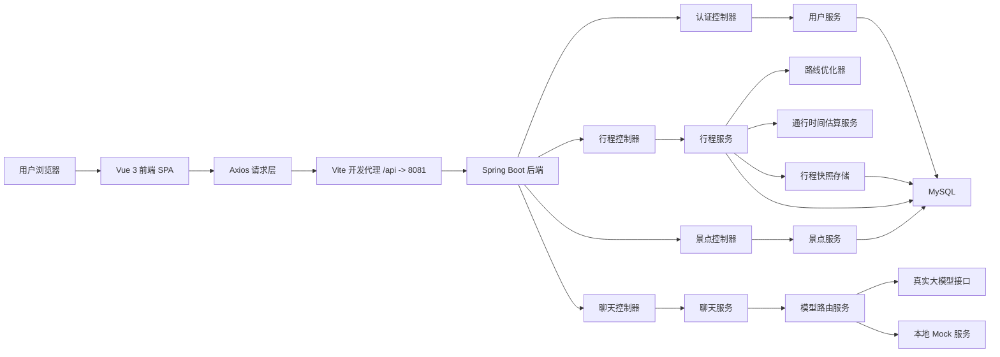
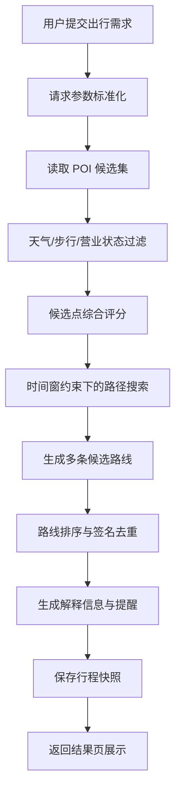
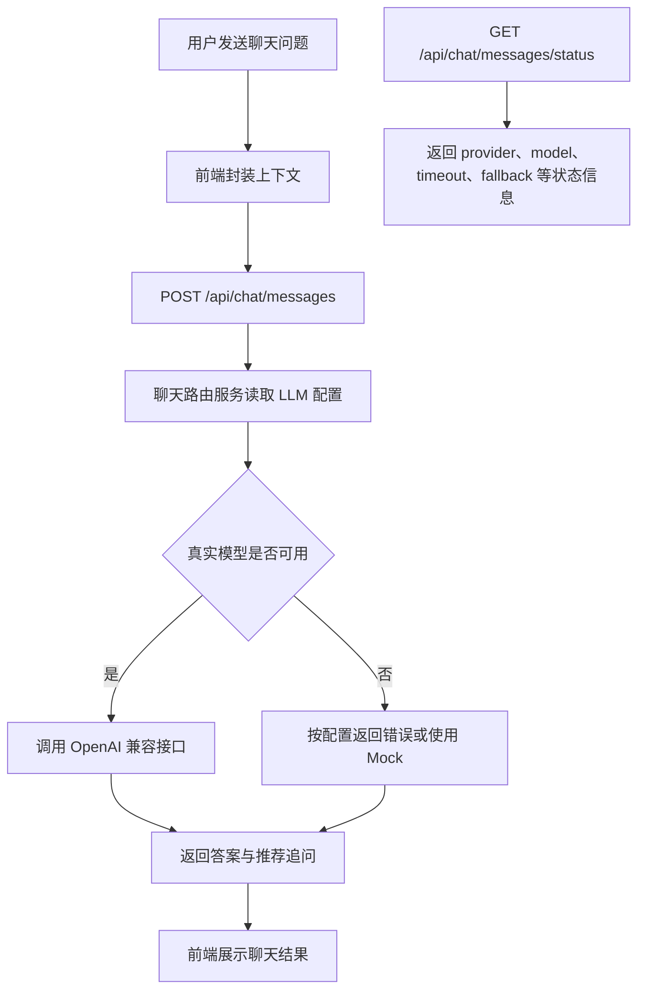

# 行城有数系统功能模块与系统架构分析文档

## 1. 文档说明

### 1.1 编写目的

本文档用于对“行城有数”城市旅游智能行程规划系统进行正式、系统和可答辩化的分析说明，重点覆盖以下内容：

1. 系统建设目标与业务定位。
2. 系统功能模块划分与职责边界。
3. 前后端整体架构与核心技术路线。
4. 行程生成、多方案对比、解释型推荐等关键业务流程。
5. 数据库设计、接口设计与工程化实现特点。
6. 当前系统优势、局限与后续优化方向。

本文档适用于课程设计报告、项目说明书、大创中期或结题材料、答辩文稿整理以及软著材料辅助说明。

### 1.2 系统名称

系统名称：行城有数  
系统定位：面向城市短途文旅场景的个性化智能行程规划系统  
当前应用场景：以成都城市游、短途游、一日游场景为主

### 1.3 文档对应版本

本文档对应当前项目最新实现，已覆盖以下近期新增内容：

1. 多方案路线生成与候选方案对比。
2. 解释型推荐与“为什么推荐/为什么不优先推荐”说明。
3. 地图路线展示。
4. 历史行程、收藏与自定义命名。
5. RESTful 风格接口重构。
6. 聊天服务状态检查接口。
7. 环境变量化配置与工程化整理。

---

## 2. 系统概述

### 2.1 项目背景

传统旅游推荐系统通常存在以下问题：

1. 推荐结果偏静态，只能给出景点列表，缺少时间顺序与路线可执行性。
2. 很少同时考虑预算、天气、步行强度、同行类型和景点营业状态等现实约束。
3. 即使接入 AI，也往往停留在“生成一段文案”，缺少真正的路线规划能力。
4. 用户对推荐结果缺乏理解，不清楚系统为什么推荐某条路线。

针对这些问题，本项目以“智能路线规划”为核心，构建了一个前后端分离的旅游行程推荐系统。系统不把路线生成完全交给大模型，而是采用“规则与优化算法主导 + LLM 辅助问答和解释”的混合模式，提升推荐结果的稳定性、可执行性和可解释性。

### 2.2 建设目标

系统的主要建设目标如下：

1. 为用户提供可落地的城市旅游路线规划能力，而不仅是景点堆砌。
2. 在规划过程中综合考虑时间窗、预算、主题偏好、天气、夜游需求、步行强度和景点开放状态。
3. 一次返回多条可比较方案，支持用户在结果页进行决策，而不是只被动接受单一答案。
4. 提供解释型推荐，让用户理解“为什么推荐”和“为什么不优先推荐其他方案”。
5. 提供路线动态重排和站点替换能力，增强系统对用户即时偏好变化的适应能力。
6. 通过地图、历史、收藏、命名等能力提升产品完整度和连续使用体验。
7. 保持架构清晰、实现可维护、具备课程项目和大创展示价值。

### 2.3 系统核心特点

本系统的核心特点可以概括为以下四点：

1. 算法主导而非纯文案生成。  
   行程生成、路线重排和点位替换由后端优化逻辑决定，LLM 不直接决定整条路线。

2. 多目标综合约束。  
   系统同时考虑偏好匹配、营业时间、通行成本、预算和场景约束，使推荐更接近真实出游过程。

3. 结果可比较、可解释。  
   系统一次给出多条候选路线，并对每条路线的亮点、取舍和不优先原因进行说明。

4. 具备完整产品闭环。  
   用户可以从“输入需求”走到“生成路线、查看地图、替换站点、历史回看、收藏命名、继续调整”的完整使用路径。

---

## 3. 系统功能模块分析

结合当前代码实现，系统可划分为九个核心功能模块。

### 3.1 用户认证与会话管理模块

该模块负责用户注册、登录、退出和登录态维护。

主要功能包括：

1. 新用户注册。
2. 账号密码登录。
3. 退出当前会话。
4. 获取当前登录用户信息。
5. 对受保护页面和接口做登录校验。

实现特点：

1. 后端采用 `HttpSession` 保存登录用户编号。
2. 前端通过路由守卫限制 `/result`、`/history`、`/detail/:id` 等页面访问。
3. 接口采用更 RESTful 的资源风格，例如 `POST /api/users`、`POST /api/sessions`、`GET /api/users/me`。

该模块保证了历史记录、收藏、AI 问答和行程管理能力建立在稳定的用户身份基础上。

### 3.2 出行需求采集模块

该模块位于首页，是系统的核心输入入口。

用户可输入或选择的条件包括：

1. 出行日期。
2. 开始时间和结束时间。
3. 出游天数。
4. 预算等级。
5. 主题偏好。
6. 同行类型。
7. 步行强度。
8. 是否雨天场景。
9. 是否夜游场景。

该模块的作用不是单纯收集表单，而是为后端构建结构化约束集，为后续候选点过滤、评分和路径搜索提供基础。

### 3.3 智能行程生成模块

这是系统最核心的业务模块。

其主要职责包括：

1. 标准化用户请求参数。
2. 从 POI 数据中筛选候选景点。
3. 基于多维因素对候选景点打分。
4. 在时间窗约束下进行路径搜索。
5. 生成结构化时间轴节点。
6. 组织总时长、总预算、提醒信息和推荐说明。
7. 保存行程快照。

该模块的输出结果不再是单条路线，而是一组候选路线集合，并带有当前默认选中方案。

### 3.4 多方案对比与解释型推荐模块

这是当前版本相较于传统旅游规划系统最有辨识度的功能之一。

该模块的主要功能包括：

1. 一次返回多条候选路线。
2. 为每条路线提供标题、副标题和摘要。
3. 提供推荐理由 `recommendReason`。
4. 提供非优先理由 `notRecommendReason`。
5. 给出亮点列表 `highlights`。
6. 给出取舍说明 `tradeoffs`。
7. 给出营业风险、主题匹配、通行时间等比较指标。

这使系统从“给出答案”升级为“支持决策”，具备更强的研究展示价值和答辩说服力。

### 3.5 地图路线展示模块

结果页接入了地图路线展示功能，用于将推荐路线以空间可视化方式呈现给用户。

主要功能包括：

1. 基于路线节点经纬度展示地图。
2. 按行程顺序绘制路线连线。
3. 为每个站点展示编号和名称。
4. 支持路线变化后重新绘制地图。
5. 与结果页的时间轴和当前选中方案保持一致。

地图展示大幅提升了系统的产品观感，也让路线“是否顺路”更容易被直观理解。

### 3.6 行程动态重排模块

当用户点击“换一版路线”时，系统并不是简单地把现有景点换个顺序，而是重新寻找新的可行方案。

该模块的特点包括：

1. 基于当前请求条件重新计算可行候选方案。
2. 会记录和排除已经尝试过的路线签名。
3. 避免在几条旧路线之间来回切换。
4. 当没有更优新方案时给出明确提示，而不是伪造变化。

这使动态重排从“随机换一条”变成“有限候选空间中的有效替代搜索”。

### 3.7 景点详情与站点替换模块

用户可从结果页进入景点详情页查看单点信息，并触发对当前站点的替换。

主要功能包括：

1. 查看景点地址、分类、时间、费用和说明。
2. 根据原站点类型、区域和通行成本寻找相近替代点。
3. 在替换某一个站点后重新计算整条路线。
4. 返回更新后的时间轴与地图展示。

该模块让系统不仅能“规划整条路线”，还能支持用户对细节进行局部干预。

### 3.8 历史行程、收藏与命名模块

该模块解决了“路线生成一次就消失”的问题，增强了系统的连续使用能力。

主要功能包括：

1. 保存用户历史行程快照。
2. 查看全部历史行程。
3. 查看仅收藏的路线。
4. 收藏当前选中的候选路线。
5. 为收藏路线自定义命名。
6. 从历史记录继续进入结果页进行调整。

特别说明：

1. 收藏的是用户当前选中的方案，而不是整组三条方案全部被视为收藏。
2. 收藏时支持命名，便于后续检索和回顾。
3. 后端通过 `saved_itinerary` 进行快照持久化，前端通过浏览器存储做本地恢复。

### 3.9 AI 问答与模型状态管理模块

系统当前保留 AI 助手能力，但其职责已经更聚焦于辅助说明，而不承担整条路线的生成。

主要功能包括：

1. 支持首页 AI 面板和全局聊天组件。
2. 聊天可携带当前页面类型、偏好、雨天、夜游、同行类型等上下文。
3. 支持 `mock`、`real`、`auto` 三种模型路由模式。
4. 在模型配置或调用异常时，优先返回明确错误，而不是简单伪装为正常答案。
5. 提供聊天状态检查接口，便于开发调试和运行排障。

新增的状态检查能力使系统从“会不会调模型”进化到“能不能看见当前模型状态”，提升了工程化质量。

---

## 4. 系统总体架构设计

### 4.1 架构模式

系统采用典型的前后端分离架构。

1. 前端采用 Vue 3 单页应用，负责页面展示、交互逻辑、局部状态管理与地图可视化。
2. 后端采用 Spring Boot 单体应用，负责认证、景点数据处理、路线规划、历史存储和 AI 路由。
3. 数据层采用 MySQL 存储用户、景点和行程快照。
4. 外部能力层通过 OpenAI 兼容接口提供大模型问答能力，同时保留本地 Mock 作为兜底或开发模式。

本系统目前仍属于“单体后端 + 分离前端”的轻量化架构，而非微服务架构。该架构对于课程项目、大创展示和小型演示系统是合适的，因为实现成本较低，结构清晰，便于快速迭代。

### 4.2 总体架构图

### 4.3 逻辑分层说明

系统逻辑上可划分为四层：

1. 表现层。  
   对应前端页面、组件、地图视图、聊天组件、路由守卫和接口封装。

2. 业务层。  
   对应后端的认证逻辑、行程规划逻辑、路线重排逻辑、点位替换逻辑、收藏与历史逻辑、聊天路由逻辑。

3. 数据层。  
   对应 MyBatis-Plus Mapper、实体类和 MySQL 数据表。

4. 外部服务层。  
   对应真实模型接口和本地 Mock 能力。

---

## 5. 前端架构分析

### 5.1 前端技术路线

前端采用 Vue 3 构建单页应用，结合 Vue Router 完成页面组织，Axios 负责接口通信，Element Plus 负责基础交互组件，Leaflet 负责地图展示，Vite 负责开发代理和构建。

### 5.2 前端模块划分

前端主要由以下几个部分组成：

1. `views` 页面层。  
   包括首页、结果页、历史页、认证页、景点详情页。

2. `components` 组件层。  
   包括首页表单区、AI 面板、导航栏、悬浮聊天框、路线地图卡片等。

3. `api` 接口封装层。  
   对认证、行程、景点和聊天接口做统一封装。

4. `store` 或状态层。  
   负责维护认证信息、行程快照、聊天状态等。

5. `router` 路由层。  
   负责页面跳转和登录访问控制。

### 5.3 前端页面结构

当前前端主要页面包括：

1. 首页 `/`。  
   负责收集出行需求，并提供 AI 入口。

2. 认证页 `/auth`。  
   负责注册和登录。

3. 结果页 `/result`。  
   负责展示多方案对比、时间轴、地图、推荐说明、重排和收藏操作。

4. 历史页 `/history`。  
   负责查看历史行程、收藏路线、命名和继续调整。

5. 详情页 `/detail/:id`。  
   负责查看景点详情，并发起站点替换。

### 5.4 前端职责边界

前端主要承担以下职责：

1. 收集用户输入。
2. 发起 RESTful 请求。
3. 显示路线对比和地图。
4. 缓存当前行程快照。
5. 维护聊天记录和用户会话体验。

业务决策和路线计算并不在前端完成，而是严格放在后端。这样可以避免前端逻辑过重，也更符合系统的整体分层原则。

---

## 6. 后端架构分析

### 6.1 后端技术路线

后端以 Spring Boot 为核心框架，以 MyBatis-Plus 负责数据访问，MySQL 作为持久化数据库，RestTemplate 负责外部模型调用。

### 6.2 后端分层结构

后端采用典型的分层结构：

1. `controller` 控制层。  
   负责接收请求、参数绑定和响应返回。

2. `service` 业务层。  
   负责认证、景点处理、路线生成、路线重排、点位替换、收藏和聊天路由等核心逻辑。

3. `mapper` 数据访问层。  
   负责数据库读写。

4. `model` 模型层。  
   包括 DTO、VO 和 Entity。

5. `config` 配置层。  
   包括跨域、拦截器、属性绑定和 HTTP 客户端配置。

6. `common` 通用层。  
   包括统一异常与常量定义。

### 6.3 后端核心职责

后端承担了系统绝大部分关键计算任务，主要包括：

1. 认证与登录态维护。
2. 景点数据查询与营业状态增强。
3. 用户请求标准化。
4. 候选点过滤与评分。
5. 路线搜索、多方案排序与解释组织。
6. 行程快照保存、历史列表和收藏管理。
7. LLM 路由、降级和状态检查。

---

## 7. 核心业务逻辑与算法设计

### 7.1 行程生成总体流程

系统的行程生成不是简单排序，而是完整的多阶段计算过程。

主要步骤如下：

1. 接收用户结构化需求。
2. 标准化时间、主题、雨天、夜游和步行强度参数。
3. 从 `poi` 表读取候选景点。
4. 根据天气和步行约束做初筛。
5. 根据景点状态增强结果过滤掉明显不可行的点。
6. 对剩余候选点做多维评分。
7. 在时间窗约束下执行路径搜索，生成多条候选路线。
8. 对候选路线做排序和签名去重。
9. 为每条路线生成摘要、亮点、取舍和解释。
10. 将结果保存到行程快照并返回前端。

### 7.2 行程生成流程图

### 7.3 候选景点筛选策略

候选景点筛选主要考虑以下因素：

1. 雨天约束。  
   若用户设置为雨天，则优先保留室内或雨天友好景点。

2. 步行强度约束。  
   系统会比较用户步行等级与景点步行等级，过滤掉明显不匹配的点。

3. 景点可用性约束。  
   系统会结合闭馆日、临时关闭、营业时间完整性和状态更新时间判断景点可用性。

### 7.4 景点评分策略

单个景点评分不是单一值，而是多个因素叠加的结果，主要包括：

1. 景点优先级基础分。
2. 与用户主题偏好的匹配加分。
3. 与同行类型的适配加分。
4. 夜游场景适配加分。
5. 雨天友好属性加分。
6. 步行等级匹配加分。
7. 状态过旧或营业信息缺失扣分。
8. 停留时间过长带来的调度惩罚。

这一评分设计体现了系统从“热门推荐”转向“场景匹配推荐”的思路。

### 7.5 路径搜索策略

当前系统使用的是一种带时间窗约束的启发式 Beam Search。

其基本思路如下：

1. 将每个景点视为一个候选节点。
2. 状态中记录已访问集合、最后一个点、当前时间和累计效用。
3. 每一轮从当前状态向未访问点扩展。
4. 扩展时会同时考虑：
   到达时间、等待开门时间、停留时长、闭馆时间和结束时间上限。
5. 每层只保留较优状态，避免搜索空间爆炸。
6. 最终产出多条可执行路线，而不是只保留一条结果。

该策略兼顾了性能与实际可用性，适合当前项目规模。

### 7.6 多方案对比与解释型推荐逻辑

系统会将生成出的候选路线按综合效用排序，并为每条路线构造面向用户的解释信息。

解释型推荐主要回答两个问题：

1. 为什么推荐这条路线。  
   例如主题更贴合、营业风险更低、顺路程度更高、预算更平衡。

2. 为什么不优先推荐其他路线。  
   例如步行更重、成本更高、存在营业不确定性、景点数过多导致节奏紧张。

这使系统在结果输出层从“给结论”提升为“给决策依据”，是很重要的研究展示点。

### 7.7 动态重排逻辑

动态重排的设计目标不是“变化”，而是“产生尚未尝试过的新可行方案”。

主要逻辑如下：

1. 读取当前行程快照和当前方案签名。
2. 接收前端传来的已尝试路线签名集合。
3. 重新生成候选路线列表。
4. 排除已经出现过的签名。
5. 返回新的路线集合。
6. 若无新的可行路线，则返回“目前没有更好的新方案”的提示。

这样可以避免系统在有限候选空间中反复切换旧路线。

### 7.8 站点替换逻辑

站点替换逻辑主要包括：

1. 根据目标站点识别当前替换位置。
2. 从候选点中寻找类别相近、区域相近、通行成本较低的替代点。
3. 对整条路线重新排序和计算时间安排。
4. 更新路线节点、提醒和地图坐标。

它体现的是“局部调整 + 全局重算”的设计思想。

### 7.9 通行时间估算逻辑

系统当前未接入真实地图服务，而是采用本地启发式估算。

估算过程如下：

1. 使用经纬度通过 Haversine 公式计算两点直线距离。
2. 通过道路折算系数转换为近似路网距离。
3. 根据距离区间选择步行、公共交通或打车速度模型。
4. 输出估算通行分钟数。

该设计实现成本低、部署简单，适合项目演示和初期系统构建。

### 7.10 AI 路由与状态检查逻辑

AI 聊天模块支持三种模式：

1. `mock`：只用本地 Mock。
2. `real`：只用真实模型。
3. `auto`：优先真实模型，不可用时切回 Mock。

当前系统新增了聊天状态检查接口，可直接返回以下信息：

1. 当前 provider。
2. 是否具备真实模型调用条件。
3. 是否开启 fallback。
4. 当前 timeout 设置。
5. 当前 baseUrl 和 model。
6. 当前状态说明。

这对开发联调、比赛演示和后续运维都非常重要。

### 7.11 聊天与状态流程图

---

## 8. 数据库设计分析

### 8.1 数据库总体说明

系统数据库采用 MySQL，核心围绕三类数据组织：

1. 用户身份数据。
2. 景点基础与营业状态数据。
3. 行程快照与历史收藏数据。

### 8.2 用户表 `trip_user`

该表主要用于保存用户注册信息和认证相关数据。

主要字段通常包括：

1. 用户编号。
2. 用户名。
3. 密码摘要。
4. 盐值。
5. 昵称。
6. 创建时间与更新时间。

该表支撑注册、登录、获取当前用户等能力。

### 8.3 景点表 `poi`

该表是系统最核心的业务基础数据表。

主要字段可归纳为：

1. 景点名称、分类、区域和地址。
2. 纬度与经度。
3. 停留时长和消费成本。
4. 是否室内、是否夜游、是否雨天友好。
5. 步行等级、适合人群、标签。
6. 营业时间。
7. 闭馆星期。
8. 临时关闭标记。
9. 状态说明与状态更新时间。

从设计上看，该表既承担静态景点信息，也承担“景点可访问性”的业务状态来源。

### 8.4 行程快照表 `saved_itinerary`

该表用于保存用户生成后的行程结果。

主要字段包括：

1. 行程编号。
2. 用户编号。
3. 原始请求 JSON。
4. 行程结果 JSON。
5. 自定义标题。
6. 是否收藏。
7. 收藏时间。
8. 节点数量。
9. 总时长。
10. 总费用。
11. 路线签名。
12. 创建时间和更新时间。

该表采用“快照式存储”而不是高度范式化拆表，其优点包括：

1. 恢复完整结果简单。
2. 收藏与历史查询逻辑清晰。
3. 对于当前系统规模，开发效率更高。

---

## 9. 接口设计分析

### 9.1 接口风格

当前项目整体已按 RESTful 资源风格进行整理。

主要资源包括：

1. 用户资源 `users`。
2. 会话资源 `sessions`。
3. 行程资源 `itineraries`。
4. 景点资源 `pois`。
5. 聊天消息资源 `chat/messages`。

### 9.2 认证相关接口

1. `POST /api/users`：注册用户。
2. `POST /api/sessions`：创建会话。
3. `DELETE /api/sessions/current`：退出当前会话。
4. `GET /api/users/me`：获取当前用户。

### 9.3 行程相关接口

1. `POST /api/itineraries`：生成行程。
2. `GET /api/itineraries`：获取历史列表。
3. `GET /api/itineraries/{id}`：获取行程详情。
4. `PATCH /api/itineraries/{id}/replan`：换一版路线。
5. `PATCH /api/itineraries/{id}/nodes/{poiId}/replacement`：替换某一站点。
6. `PUT /api/itineraries/{id}/favorite`：收藏并命名当前选中路线。
7. `DELETE /api/itineraries/{id}/favorite`：取消收藏。

### 9.4 景点相关接口

1. `GET /api/pois`：获取景点列表。
2. `GET /api/pois/{id}`：获取景点详情。

### 9.5 聊天相关接口

1. `POST /api/chat/messages`：发送聊天消息。
2. `GET /api/chat/messages/status`：获取聊天服务状态。

接口设计目前已经具备较好的规范性和扩展性，后续如果补充 Swagger/OpenAPI 文档，将更适合比赛展示和论文附录说明。

---

## 10. 非功能设计与工程化实现

### 10.1 登录态与安全性

当前系统基于 `HttpSession` 做登录态维护，具有实现简单、适合单体项目的优势。

同时系统已做以下工程化改进：

1. 使用拦截器和注解统一处理登录校验。
2. CORS 改为来源可配置，不再默认对任意来源开放携带凭证。
3. 数据库密码和模型密钥改为环境变量读取，避免敏感信息直接写入配置文件。

### 10.2 性能与构建优化

前端已经进行了基础分包，至少将 `vue`、`leaflet` 和 `element-plus` 从主入口中拆分。

当前效果包括：

1. 主业务入口包明显下降。
2. 地图能力作为独立 chunk 加载。
3. 但 `element-plus` chunk 仍然较大，后续仍可继续做按需引入。

### 10.3 可观测性与排障能力

系统在近期新增了更强的可观测性支持：

1. 聊天失败时优先返回真实错误而不是统一伪装。
2. 提供聊天状态检查接口。
3. 全局异常处理改为标准日志输出。

这类能力虽不直接面向最终用户，但对开发质量和演示可靠性很关键。

---

## 11. 系统优势分析

结合当前实现，系统主要优势体现在以下方面：

1. 架构清晰。  
   前后端分离、控制层与业务层边界明确，便于维护和扩展。

2. 业务闭环完整。  
   已经形成“需求输入 -> 路线生成 -> 方案对比 -> 地图查看 -> 动态调整 -> 收藏回看”的完整链路。

3. 不是单纯的 AI 套壳。  
   核心路线由算法生成，AI 更多承担说明和问答能力，这一点更具研究价值。

4. 可解释性较强。  
   系统能说明为什么推荐某条路线，而不是只给结果。

5. 产品完成度较高。  
   地图、历史、收藏、命名、聊天、重排等能力已经使项目具备明显产品形态。

6. 工程整理较好。  
   已完成较大程度的 RESTful 改造、配置收敛和文档同步。

---

## 12. 当前不足与限制分析

尽管系统已经具备较强的完整性，但仍存在以下不足：

1. 当前登录方案仍基于 Session。  
   若后续做多实例部署，需要共享 Session 或迁移到 JWT/Redis Session。

2. 通行时间为启发式估算。  
   未接入真实地图路线服务，因此精度有限。

3. 暂未提供后台管理端。  
   景点数据维护仍需依赖数据库或脚本，管理能力不足。

4. 个性化学习能力仍有限。  
   系统目前主要基于规则和标签，还没有基于用户长期行为的学习机制。

5. 前端包体积仍有优化空间。  
   特别是 Element Plus chunk 仍偏大。

6. 自动化测试不足。  
   目前以人工验证和构建验证为主，后续需要补单元测试和关键流程测试。

---

## 13. 后续优化方向

结合当前项目状态，后续最值得继续推进的方向包括：

1. 增加前端可见的模型状态面板。  
   直接展示当前聊天服务的 provider、model、fallback 和可用性状态。

2. 引入更真实的地图与路线能力。  
   接入真实地图服务，提升通行时间估算与路线展示可信度。

3. 增强个性化能力。  
   根据用户历史收藏、切换和替换行为动态调整路线评分权重。

4. 增加分享与导出能力。  
   生成行程海报、分享页或 PDF，以提升产品展示效果。

5. 完善测试体系。  
   增加后端服务层测试、接口测试和前端关键流程测试。

6. 构建管理端。  
   用于维护景点、营业状态和运营数据。

7. 继续做前端瘦身。  
   尤其是 Element Plus 的按需引入和更细粒度的动态拆包。

---

## 14. 结论

综上所述，当前“行城有数”已经不是一个简单的旅游信息展示网页，而是一个具备明确业务主线、较完整功能闭环和较强展示价值的城市旅游智能行程规划系统。

从功能层面看，系统已经覆盖了：

1. 用户认证。
2. 需求采集。
3. 智能行程生成。
4. 多方案对比。
5. 解释型推荐。
6. 地图路线展示。
7. 动态重排与点位替换。
8. 历史收藏与命名。
9. AI 问答与状态检查。

从架构层面看，系统采用了清晰的前后端分离方案，后端以规则与优化算法为核心，前端承担展示与交互，数据库负责快照与基础数据持久化，外部模型能力则作为增强模块接入。

从项目价值看，系统兼具以下特征：

1. 具备课程设计和大创项目的完整性。
2. 具备答辩展示所需要的亮点和差异化。
3. 具备继续向个性化推荐、地图联动和分享传播扩展的潜力。

因此，该系统已经具备较强的项目完成度和进一步申报、展示、答辩与整理成果材料的基础。
